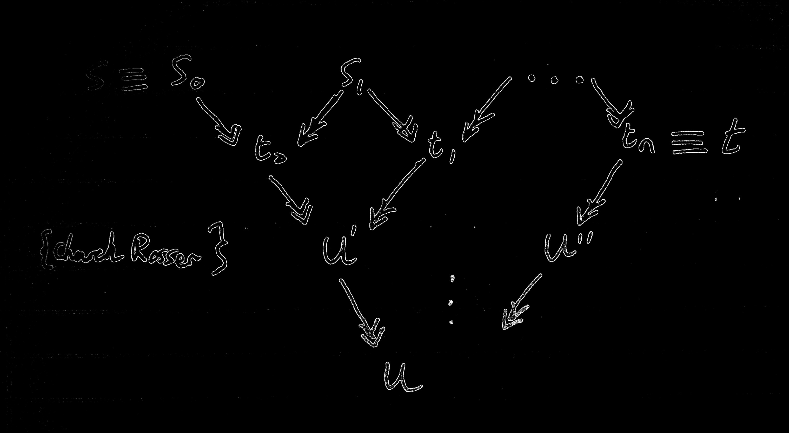

Lambda Calculus
================

* * *

##Contents

+ [Rules of λβ](#rulesOLambdaBeta)
+ [Equality of →β](#βequality)
+ [Head Reduction and *OTHER* reductions! 😮](#head)
+ [Consistency](#consistency)
+ [Genericity Lemma](#genericity)
+ [Combinators](#combinators)
+ [Y Combinator](#Ycombinator)
+ [Church Numerals](#ChurchNumerals)
+ [Scott's Curry Theorem 🍛🍛🍛](#ScottCurry)
+ [Functions - Recursive or otherwise](#functions)
+ [Combinatory Logic](#CLs)
+ [Combinatory Algebras](#CAs)
+ [Types](#types)
+ [Typability](#typability)
+ [Robinson's Unification Algorithm](#Robinsons)
+ [Principal type algorithm](#TypeAlgorithm)
+ [Undecidability Results](#undecidability)

* * *
Rules of λβ
-------------------------------------------------------------------
s=t  
\-\-\-\-\- Symmetry  
t=s

s = t     t = u  
\-\-\-\-\-\-\-\-\-\- Transitivity
s = u

etc, etc...

So λβ|- s=t  is not defined as =β but they are provably equivalent.  

λβ|- s=t is defined as:  
Symmetry, transitivity, reflexivity  
Application, abstraction, β-reduction.  

and

=β is the reflexive, symmetric, transitive closure of →β

Exercise: show =β implements λβ  

First recursion theorem:  
∀f∈Λ ∃u∈Λ st fu = u

Second recursion theorem:  
∀f ∃u st f[[u]]=u

* * *
β Equality, reflexive transitive closure of →β
-------------------------------------------------------------------

Diagram of the two way equality.

Just prove it using the diagram and make use of Church-Rosser.

The precise thing would be:
At each level we reduce to one less term.
So after n-1 levels we have only 1 term.

* * *
Head Reduction
-------------------------------------------------------------------

This is HNF:  
s ≡ λx1...xn . y s1...sm

###Head Reduction:  
λx0...xn . (λy.u)t s0•...•sm →h λx0...xn . u[t/y]•s0•...•sm

An application can

A headmost reduction is always a **LEFTMOST reduction**. And it's *bloody*
obvious what a leftmost reduction is.

Solvable *IFF* HNF

###Internal reduction
A β reduction that isn't a head reduction.

###Other Reductions.

Leftmost - Not even going to define this. DBI.  
Standard - Once something is reduced, nothing to the left of that is reduced.  
(Standard is a property of a whole reduction).  

A standard deduction has to precede from the left, but not necessarily left**most**!

Head and leftmost reductions are standard. #standard.

###Some results

1. Every standard reduction sequence ending in a normal form is leftmost.
2. If s has a β normal form. Then standard reduction is sufficient (specifically **leftmost** is sufficient) to obtain it.

* * *
Consistency
----------------------------------------------------------------
To show it isn't consistent show that it equates all terms.

So for all s, t. They can be equated.

* * *
Genericity Lemma
-------------------------------------------------------------------

FOR ALL/ANY CONTEXTS C

If s is unsolvable

and **C[s] = t**  for some solvable t  
then for all x: **C[x] = t**

So if a context can take an unsolvable term and return a solvable term.
It must just ignore its input.

Sometimes we use two contexts to show that one thing holds for **C**
and then something holds for **C'** and for some input **C** = **C'**.

* * *
Combinators
-------------------------------------------------------------------
**ω**=λx.xx  
**Ω**=**ωω**  

**t**=λxy.x  
**f**=λxy.y  

**k infinity**=**YK**

**k**=λxy.x  
**s**=λxyz.xz(yz)

**i** = Well this one is obvious...

**θ** = (λxy.y(xxy)) (λxy.y(xxy))  ≡ **Y S i**  
**Y** = λf.(λx.f(xx))

* * *
The Y combinator
-------------------------------------------------------------------
Yf = f(Yf)

<!-- Y = λf.(λx.f(xx))(λx.f(xx)) -->

Q:Find some term **s** st: s = λx.xss
Abstract out s: λsx.xss and then apply the Y combinator.

s ≡ Y(λsx.xss)

then s ≡ Y(λsx.xss) = (λsx.xss)(Y(λsx.xss)) = λx.xss 😄

* * *
Church Numerals
-------------------------------------------------------------------

[n] = λfx. fff...fffx    \{naturally n lots of f's\}  
[0] = λfx.x    (=**f**)  
[1] = λfx.fx  

Lists - xxyz

Godel Numbering - We basically have an enumeration of the terms.
So for each integer we have an associated term.
And for each term we have an associated integer.

* * *
Scott's Curry Theorem
-------------------------------------------------------------------

###The Curry
Φ ⊊ A,B ⊊ Λ and A, B closed under β-Convertability:

There does not exist a term f st for all terms x

fx = **t** iff x in A
fx = **f** iff x in B

###The Lemma
For some set X.  
Φ ⊊ X ⊊ Λ and X closed under β-Convertability ====> X is not recursive.  

* * *
Functions - Recursive or otherwise
-------------------------------------------------------------------

Partial function <====> Strongly λ-definable.

* * *
Combinatory Logic
-------------------------------------------------------------------

Made of four components:

+ Variables: x ∈ V then x ∈ Tcl
+ **K**
+ **S**
+ Composition: A,B ∈ Tcl then AB ∈ Tcl

3 rules:

+ Application A=A' B=B' then AB=A'B'
+ **K** A B = B
+ **S** A B C = A C (B C)

**I** = **SKK**

###Fake Lambda

+ λλx.x = **SKK**  
+ λλx.A = **K** A  Where x not in A  
+ λλx.BC = **S**(λλx.B)(λλx.C)  Where in B or C.  

Combinatory Algebras
-------------------------------------------------------------------

Term Algebra is a quadruple - < A, . , **K**, **S** \>

An environment (valuation) is just a map P: V ---> A
Maps variables to terms of our algebra.

###λ-Algebra
An algebra in which λβ |- t=u ===> ∀p [[t]]p = [[u]]p  

(Not godel numbering, this is the actual syntax, it's for evaluation under a map).

* * *
Types
-------------------------------------------------------------------
\-\-\-\-\-\-\-\-\-\-\-\-\-\-\-\-\-\-\-\-\-\-\-\-\-\-\-\-\-\-\-\- Variables  
\{x:A\} |--> x:A  

Γ ➡️ s: A▶️B, Γ' ➡️  t: A  
\-\-\-\-\-\-\-\-\-\-\-\-\-\-\-\-\-\-\-\-\-\-\-\-\-\-\-\-\-\-\-\- Application  
Γ U Γ' ➡️ st:B

Γ➡️s:B  
\-\-\-\-\-\-\-\-\-\-\-\-\-\-\-\-\-\-\-\-\-\-\-\-\-\-\-\-\-\-\-\- Abstraction \{Γ consistent with \{x:A\} \}  
Γ ➡️ λx.s : A ▶️ B

We say two types are consistent if they don't contradict on the type of any variable.

Subject Construction Lemma: Construction tree and deduction trees are like the same but upside down lol. ↕️

Deductions are unique when the term is in β-Normal form.

Subject Reduction Theorem - S:A and S reduces to t then t:A  
Γ |- s : A and s →β t  =======>  Γ |- t : A

Typable terms are closed under:

1. Subterms
2. β-Reduction
3. Abstraction

* * *
Typability
-------------------------------------------------------------------

Typability → Strongly Normalising

However λx.xx *is* strongly normalising, but **NOT** typable.

Terms that are untypable:

+ xx
+ λx.xx   (=ω)
+ Ω = (λx.xx) (λx.xx)
+ Y = λf. (λx.f(xx)) (λx.f(xx))

Principal Deduction - A deduction of **s : A** such that all other
deductions of **s : A** are instances of this deduction.

Principal type Algorithm  
Returns either that the term is untypable, or it returns the principal type.

* * *
Robinson's Unification Algorithm  
-------------------------------------------------------------------

Determines whether two types are unifiable and if so it returns the most general unifier.

	Input(A, B):
		i=0
		U0 = E 	//The empty/identity unification.
		while(true)
			if (Ui(A) = Ui(B)) return U = Ui

			else //Ui(A) and Ui(B) differ somewhere.
				//Ui(A) = String1 c stringa
				//Ui(B) = String1 D stringb

				if(c in Vars(D)) return untypable
				else Ui+i = [D/c] . Ui
			i++

* * *
Principal type algorithm
-------------------------------------------------------------------
Input s a term. Output S's principal type OR s is untypable.

* * *
Undecidability Results
-------------------------------------------------------------------
1. Equality in λβ is undecidable.

2. However equality of **typable** terms is decidable because they are strongly
normalising.

3. Undecidable if a term has a normal form. (Page 109/203 lecture slides.)

4. Undecidable if a term is solvable.

5. Undecidable if a term is equal to some numeral.
